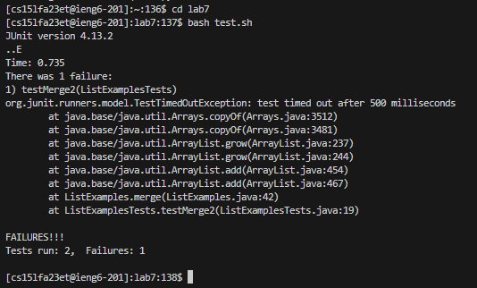

# Lab Report 4 | VIM
## Kevin William Peoples | A17465911

**Timing Tasks!**
1) Log into ieng6  

2) Cone the forked repository:  https://github.com/kepeoples/lab7.  
The command we will use is   ```git clone  https://github.com/kepeoples/lab7```

3) Run the tests ansd show that they are unsuccessful. Before beginning the tests, make sure you use cd to move the working directory to lab7/ or the location of the cloned lab7.  
4) Subsequently, run bash test.sh to verify the file; the result should indicate that one of the JUnit tests was not passed by ListExamples.java.  

5) To correct the failed test, edit the code file ListExamples.java. The error is that index1 is used in place of index2 in the merge's last loop.   
We are going to open vim now in order to fix the code. Since there is a bug with ListExamples.java, we will need to put vim ListExamples.java into the command-line. Vim allows us to perform command-line adjustments to a file.
6) The screen that appears next is ListExamples.java in vim!.

7) For vim:
The ```<H>``` key moves you right,       
The ```<J>``` key moves you down,      
The ```<K>``` key moves you up,      
The ```<L>``` key moves you left while using vim.
8) The, You must press ```<i>``` to enter insert mode in order to make adjustments.  As an alternative, you can type the character you want to replace it with after pressing ```<R>``` to replace one character.  All you have to do is hit the ```<esc>``` key to go from insert mode to normal mode.    
9) Let's now address the bug. The cursor needs to be moved down to the second while loop line, which is where the problem is located.  
For myself, I had to click ```<J><J><J><J><J><J><J><J><J><J><J><J><J><J><J><J><J><J><J><J><J><J><J><J><J><J><J><J><J><J><L><L><L><L><L><L><L><L><L><L><L> <R><2>``` and I typed ```:wq``` to save and close Vim after that.
10) ListExamples.java should now be repaired, and the second line down in the second while loop should read: ```index2 += 2;```
11) Execute the tests and show that they are now successful.  
   
12) Push and commit the updated version to your Github repository.
Lastly, you will need to type and enter ```git commit``` in order to commit the changes you have made to your updated clone. This will start the process of committing. Once you hit enter, you will have to type ```git add <file>``` for every file that bash indicates has to be added. It appears as follows:


13) After that, you'll be prompted to alter the title in Vim. Press ```i``` to add something, edit it, and save it by pressing ```<esc>``` and ```:wq```.

14) Use ```git commit``` once more after that, and you ought to see this:   

15) Enter git push ```git@github.com:kepeoples/lab7``` and make sure to use this command before ```git remote set-url origin git@github.com:kepeoples/lab7.git```        
kepeoples is my github username.   
Make sure to put your username.


Best wishes! I had faith in your ability! I'm excited about our upcoming tutorial! :)

